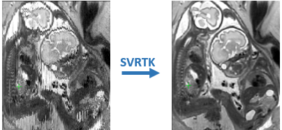

SVRTK - slice to volume reconstruction toolkit
====================

SVR reconstruction package for MIRTK (https://biomedia.doc.ic.ac.uk/software/mirtk/) for fetal MRI motion correction including:
- 3D brain
- 4D whole fetal heart, including magnitude and blood flow reconstructions
- 3D placenta
- 3D body
- SH brain diffusion (HARDI) 

The general pipeline for fetal brain reconstruction is based on the  `reconstruction`  function in IRTK: https://biomedia.doc.ic.ac.uk/software/irtk/.

4D cardiac reconstruction code was ported from the original IRTK-based implementation by Joshua van Amerom: https://github.com/jfpva/irtk_cardiac4d.

SVRTK contributes to https://github.com/mriphysics/fetal_cmr_4d pipeline.

Installation 
------------

Please follow installation instructions in InstallationInstructions.txt file.

Note, the software requires Ubuntu or OS X. In case of "-9" memory errors - please run reconstruction with "-remote" option.

Run
---

Examples: 

3D brain reconstruction:

*reconstruct ../outputSVR.nii.gz  5 ../stack1.nii.gz ../stack2.nii.gz ../stack3.nii.gz ../stack4.nii.gz ../stack5.nii.gz -mask ../mask.nii.gz  -template_number 0 -thickness 2.5 2.5 2.5 2.5 2.5 -resolution 0.75 -iterations 3 -remote*
 
 ---
4D cardiac velocity reconstruction:
- see fetal_cmr_4d git repository for full framework: https://github.com/tomaroberts/fetal_cmr_4d
 
*reconstructCardiacVelocity 5 ../phase_stack1.nii.gz ../phase_stack2.nii.gz ../phase_stack3.nii.gz ../phase_stack4.nii.gz ../phase_stack5.nii.gz ../g_values.txt ../g_directions.txt -thickness 6 6 6 6 6 -mask ../mask.nii.gz -rec_iterations 40 -transformations [folder with slice transformations from 4D cardiac reconstruction] -limit_intensities -rec_iterations 40 -resolution 1.25 -force_exclude [list of slices that should be excluded] -numcardphase 25 -rrinterval 0.407046 -rrintervals [number of rr_intervals] [list of rr_intervals] -cardphase [number of slices] [cardiac phases for each of the slices] -debug > log-main.txt*

 ---
3D placenta reconstruction:
 
*reconstructPlacenta ../outputDSVR.nii.gz  2 ../stack1.nii.gz ../stack2.nii.gz  -mask ../mask.nii.gz  -thickness 2 2 -resolution 1.0 -iterations 2 -template ../template.nii.gz -ffd -remote*
 
  ---
 3D fetal body DSVR reconstruction:

*reconstructBody ../outputDSVR.nii.gz 6 ../stack1.nii.gz ../stack2.nii.gz ../stack3.nii.gz ../stack4.nii.gz ../stack5.nii.gz ../stack6.nii.gz -mask ../mask.nii.gz -thickness 2.5 -resolution 0.85 -default -remote*
 
  ---
 Higher order spherical harmonics (SH) reconstruction of fetal diffusion brain MRI:

*reconstructDWI ../recon-3D-vol.nii.gz ../4D-DWI-stack.nii.gz ../gradient-directions.b ../target-atlas-space-T2-volume.nii.gz ../dof-to-atlas-space.dof -mask ../mask.nii.gz -order 4 -motion_sigma 15 -resolution 1.5 -thickness 2 -sigma 20 -iterations 5 -template [template_number] -motion_model_hs -sr_sh_iterations 10*

*This should followed by constrained spherical deconvolution for representation of the signal in SH basis based on the functions from MRtrix (https://github.com/MRtrix3/mrtrix3)*

*dwi2response tournier _simulated_signal.nii.gz response.txt -lmax 6 -grad ../gradient-directions.b  -force -mask ../mask.nii.gz*
*dwi2fod csd signal.nii.gz response.txt $out -lmax 6 -grad ../gradient-directions.b -force -mask ../mask.nii.gz*
 
  ---

License
-------

The MIRTK SVRTK package is distributed under the terms of the
[Apache License Version 2](http://www.apache.org/licenses/LICENSE-2.0).

Citation and acknowledgements
-----------------------------

Publications:

In case you found SVRTK useful please give appropriate credit to the software.

Original reconstruction pipeline for 3D fetal brain (original software using IRTK: https://gitlab.com/mariadeprez/irtk-simple):
> Kuklisova-Murgasova, M., Quaghebeur, G., Rutherford, M. A., Hajnal, J. V., & Schnabel, J. A. (2012). Reconstruction of fetal brain MRI with intensity matching and complete outlier removal. Medical Image Analysis, 16(8), 1550–1564.: https://doi.org/10.1016/j.media.2012.07.004

4D cardiac magnitude reconstruction (original software using IRTK: https://github.com/jfpva/fetal_cmr_4d):
> van Amerom, J. F. P., Lloyd, D. F. A., Deprez, M., Price, A. N., Malik, S. J., Pushparajah, K., van Poppel, M. P. M, Rutherford, M. A., Razavi, R., Hajnal, J. V. (2019). Fetal whole-heart 4D imaging using motion-corrected multi-planar real-time MRI. Magnetic Resonance in Medicine, 82(3): 1055-1072. : https://doi.org/10.1002/mrm.27858

4D cardiac velocity reconstruction:
> Roberts, T. A., van Amerom, J. F. P., Uus, A., Lloyd, D. F. A., Price, A. N., Tournier, J-D., Jackson, L. H., Malik, S. J., van Poppel, M. P. M, Pushparajah, K., Rutherford, M. A., Razavi, R., Deprez, M., Hajnal, J. V. (2019). Fetal whole-heart 4D flow cine MRI using multiple non-coplanar balanced SSFP stacks. bioRxiv.: https://doi.org/10.1101/635797

3D DSVR fetal body / placenta reconstruction:
> Uus, A., Zhang, T., Jackson, L., Roberts, T., Rutherford, M., Hajnal, J.V., Deprez, M. (2020). Deformable Slice-to-Volume Registration for Motion Correction in Fetal Body MRI and Placenta. IEEE Transactions on Medical Imaging (in press).: http://dx.doi.org/10.1109/TMI.2020.2974844
 
SH brain diffusion reconstruction (HARDI): 
> Deprez, M., Price, A., Christiaens, D., Estrin, G.L., Cordero-Grande, L., Hutter, J., Daducci, A., Tournier, J-D., Rutherford, M., Counsell, S. J., Cuadra, M. B., Hajnal, J. V. (2019). Higher Order Spherical Harmonics Reconstruction of Fetal Diffusion MRI with Intensity Correction. IEEE Transactions on Medical Imaging, 39 (4), 1104–1113.: https://doi.org/10.1109/tmi.2019.2943565.

