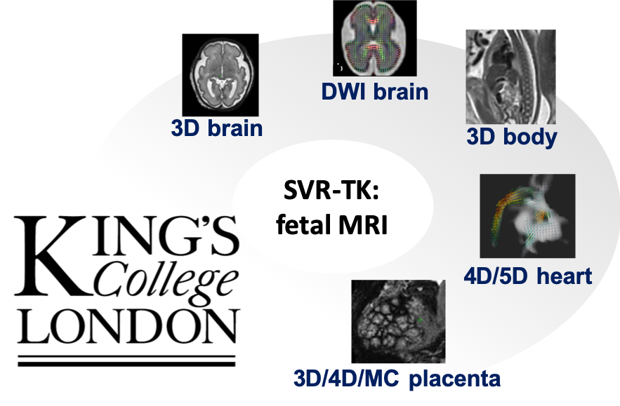

SVRTK - slice to volume reconstruction toolkit
====================



SVRTK C++ package from King's College London based on MIRTK library (https://biomedia.doc.ic.ac.uk/software/mirtk/) provides a set of functions for retrospective (image-domain) motion correction and super-resolution reconstruction for fetal MRI including:
- 3D structural brain
- 3D structural body
- 4D whole fetal heart, including magnitude and blood flow reconstructions
- 3D structural placenta
- 3D and 4D multi-channel quantitative T2* 
- SH brain diffusion (HARDI) 

SVRTK repository code was implemented by Dr Alena Uus (KCL) based on the rigid SVR code originally designed and implemented by Dr Maria Deprez (Kuklisova-Murgasova et al., 2012), available as `reconstruction` function in IRTK : https://biomedia.doc.ic.ac.uk/software/irtk/. Additional code optimisation was performed by Dr Onur Ulgen and Dr Eric Kerfoot. 

Development of SVRTK was supported by projects led by Dr Maria Deprez, Prof Mary Rutherford, Dr Jana Hutter, Dr Lisa Story and Prof Jo Hajnal. 

E.g., the “mirtk reconstruct" tool  performs SVR reconstruction of 3D high-resolution images of the fetal brain from motion-corrupted low-resolution stacks of 2D MRI slices. These output 3D images can be reoriented in any plane for diagnosis and suitable for 3D segmentation. The rest of the reconstruction tools employ additional registration and reconstruction methods depending on the specific features of the problem domain. 


4D cardiac reconstruction code was ported from the original IRTK-based implementation by Dr Joshua van Amerom: https://github.com/jfpva/irtk_cardiac4d.

SH brain diffusion reconstruction (HARDI) code was ported from the original IRTK-based implementation by Dr Maria Deprez: https://gitlab.com/mariadeprez/irtk-simple.

SVRTK contributes to https://github.com/mriphysics/fetal_cmr_4d pipeline.


Recent general review about SVR tools for fetal MRI: [Uus et al., 2022, BJR, "Retrospective motion correction in foetal MRI for clinical applications: existing methods, applications and integration into clinical practice"](https://pubmed.ncbi.nlm.nih.gov/35834425/).


In case of any questions please contact: 

*alena.uus (at) kcl.ac.uk* (main developer).

<br/><br/>

<br/><br/>

<br/><br/>


Docker 
---

Compiled SVR toolbox is available via [DockerHub](https://hub.docker.com/repository/docker/fetalsvrtk/svrtk):

```bash

docker pull fetalsvrtk/svrtk

docker run -it --rm --mount type=bind,source=location_on_your_machine,target=/home/data fetalsvrtk/svrtk /bin/bash

cd /home/data
mirtk reconstruct ../outputSVR.nii.gz  5 ../stack1.nii.gz ../stack2.nii.gz ../stack3.nii.gz ../stack4.nii.gz ../stack5.nii.gz -mask ../mask.nii.gz  -template ../stack3.nii.gz -thickness 2.5 2.5 2.5 2.5 2.5 -svr_only -resolution 0.75 -iterations 3 

```

_Notes: In order to make sure that reconstruction is fast enough - please select a sufficient number of CPUs (e.g., > 8) and amount of RAM (e.g., > 16 / 32 GB) in the Desktop Docker settings._ 


The SVRTK docker (tag auto-2.20) also contains solutions for fully automated T2w brain and thorax 3D SVR/DSVR reconstruction in the standard radiological space.

```bash

docker pull fetalsvrtk/svrtk:auto-2.20

bash /home/auto-proc-svrtk/auto-brain-reconstruction.sh /home/data/[path_to_folder_with_nii_files]  /home/data/[path_to_output_folder] OPTIONAL: [motion correction mode: (0 or 1): 0 - minor, 1 - >180 degree rotations / default: 0];  [slice thickness / default: 2.5];  [output recon resolution / default: 0.8];  [number of packages / default: 4 for 1.25 spacing, 1 for the rest]

bash /home/auto-proc-svrtk/auto-thorax-reconstruction.sh /home/data/[path_to_folder_with_nii_files]  /home/data/[path_to_output_folder] OPTIONAL: [motion correction mode: (0 or 1): 0 - minor, 1 - >180 degree rotations / default: 1];  [slice thickness / default: 2.5];  [output recon resolution / default: 0.7];  [number of packages / default: 4 for 1.25 spacing, 1 for the rest]

```

> Uus, A., Grigorescu, I., van Poppel, M., Steinweg, J. K., Roberts, T., Rutherford, M., Hajnal, J., Lloyd, D., Pushparajah, K. & Deprez, M. (2022) Automated 3D reconstruction of the fetal thorax in the standard atlas space from motion-corrupted MRI stacks for 21-36 weeks GA range. Medical Image Analysis, 80 (August 2022).: https://doi.org/10.1016/j.media.2022.102484


Installation 
------------

Please follow the installation instructions in InstallationInstructions.txt file.

_Notes: The software can be compiled on either Ubuntu(>18.0) / Debian or OS X. In order achieve optimal performance it is recommended to run reconstruction on a machine with minimum 6 CPU cores and > 16 GB (brain) / > 32 GB (body/placenta) RAM._


Run
---

Examples: 


**3D brain reconstruction:**

```bash
mirtk reconstruct ../outputSVR.nii.gz  5 ../stack1.nii.gz ../stack2.nii.gz ../stack3.nii.gz ../stack4.nii.gz ../stack5.nii.gz -mask ../mask.nii.gz  -template ../stack3.nii.gz -thickness 2.5 2.5 2.5 2.5 2.5 -svr_only -resolution 0.75 -iterations 3 -with_background 
```
 
 _Please note that it requires a 3D brain mask created (e.g., in ITK-SNAP) for the selected template stack._
 
 _Notes: The template stack should be the least motion corrupted and the brain position should correspond to the average position between all stacks (e.g., in the middle of the acquisition). The mask should be created for the template stack and cover the brain/head only - without stationary maternal tissue._
 
   ---
**3D fetal body/trunk DSVR reconstruction:**

```bash
mirtk reconstructFFD ../outputDSVR.nii.gz 6 ../stack1.nii.gz ../stack2.nii.gz ../stack3.nii.gz ../stack4.nii.gz ../stack5.nii.gz ../stack6.nii.gz -mask ../mask.nii.gz -template ../template-stack.nii.gz -thickness 2.5 2.5 2.5 2.5 2.5 2.5 -default -resolution 0.85
```

_Please note that it requires a 3D trunk mask created (e.g., in ITK-SNAP) for the selected template stack._

_In case of interleaved acquisition you can use mirtk extract-packages function to extract individual stack packages and use it as a template and use -default_packages N flag in reconstruction._

 _Notes: The template stack should be the least motion corrupted and the body/thorax position should correspond to the average position between all stacks (e.g., in the middle of the acquisition). The mask should be created for the template stack and cover the investigated ROI._

  ---
**3D placenta DSVR reconstruction:**

_Please note that it requires a 3D placenta mask created (e.g., in ITK-SNAP) for the selected template stack._

```bash
mirtk reconstructFFD ../outputDSVR.nii.gz 3 ../stack1.nii.gz ../stack2.nii.gz ../stack3.nii.gz -mask ../mask.nii.gz -template ../template-stack.nii.gz -thickness 2.5 -default -iterations 2 -thickness 2.5 2.5 2.5 -resolution 1.25
```
 ---
**4D cardiac velocity reconstruction:**
- see fetal_cmr_4d git repository for full framework: https://github.com/tomaroberts/fetal_cmr_4d
 
```bash
mirtk reconstructCardiacVelocity 5 ../phase_stack1.nii.gz ../phase_stack2.nii.gz ../phase_stack3.nii.gz ../phase_stack4.nii.gz ../phase_stack5.nii.gz ../g_values.txt ../g_directions.txt -thickness 6 6 6 6 6 -mask ../mask.nii.gz -rec_iterations 40 -transformations [folder with slice transformations from 4D cardiac reconstruction] -limit_intensities -rec_iterations 40 -resolution 1.25 -force_exclude [list of slices that should be excluded] -numcardphase 25 -rrinterval 0.407046 -rrintervals [list of rr_intervals] -cardphase [cardiac phases for each of the slices] -debug > log-main.txt
```

 ---
**3D multi-channel SVR/DSVR reconstruction for quantitative datasets with multiple echoes:**

_The registration is based only on the main set of stacks - the additional multiple echo stacks for reconstruction are passed using **-mc_n** and **-mc_stacks** flags. Note: the method assumes that all echoes are aligned. Please use **-no_intensity_matching** option for any quantitative studies._

_The method also requires a 3D mask created (e.g., in ITK-SNAP) for the selected template stack._

```bash
mirtk reconstructFFD ../outputDSVR.nii.gz 3 ../stack1_e02.nii.gz ../stack2_e02.nii.gz -mc_n 2 -mc_stacks ../stack1_e01.nii.gz ../stack2_e01.nii.gz ../t2s_map_1.nii.gz ../t2s_map_2.nii.gz -mask ../mask.nii.gz -template ../template-stack_e02.nii.gz -thickness 2.5 -structural -iterations 2 -thickness 2.5 2.5 -resolution 1.25 -no_intensity_matching

```
_The output 3D reconstructed images for all channels will be in mc-output-N.nii.gz files._

 ---
**Higher order spherical harmonics (SH) reconstruction of fetal brain diffusion MRI:**

```bash
mirtk reconstructDWI ../recon-DWI-vol.nii.gz 2 ../4D-DWI-stack-1.nii.gz ../4D-DWI-stack-2.nii.gz ../gradient-directions-1.b ../gradient-directions-2.b [selected b-value: e.g., 1000] ../target-atlas-space-T2-volume.nii.gz ../dof-to-atlas-space.dof -mask ../mask.nii.gz -order 4 -motion_sigma 15 -resolution 1.5 -thickness 2 -sigma 20 -iterations 5 -template [template_number, e.g., 10] -motion_model_hs -sr_sh_iterations 10 -resolution 1.75 -no_robust_statistics 
```

 _Notes: The algorithm uses only 1 shell for reconstruction (and it should be > 0). You need to specify it after the .b files (e.g., B=1000). The rest of the shells will be excluded. The combined file with all gradient directions for all stacks will be in final-b-file.b. The method also expects the reference image (e.g., T2 in the atlas space) and the .dof transformation to it. Please use the given default settings for reconstruction. 
 
The resulting reconstructed DWI signal will be in ../recon-DWI-vol.nii.gz and the SH coefficients are in shCoeff9.nii.gz files.
This should be followed by constrained spherical deconvolution for representation of the signal in SH basis based on the functions from MRtrix (https://github.com/MRtrix3/mrtrix3):

```bash v
dwi2response tournier ../recon-DWI-vol.nii.gz response.txt -lmax 6 -grad final-b-file.b  -force -mask ../mask-wm.nii.gz
dwi2fod csd signal.nii.gz response.txt csd-out.mif -lmax 6 -grad ../gradient-directions.b -force -mask ../mask-wm.nii.gz
```
 
 _Notes: Please note that distorion and bias field correction prior should be applied prior to reconstruction._
 
  ---

License
-------

The MIRTK SVRTK package is distributed under the terms of the
[Apache License Version 2](http://www.apache.org/licenses/LICENSE-2.0). The license enables usage of SVRTK in both commercial and non-commercial applications, without restrictions on the licensing applied to the combined work.


Disclaimer
-------

This software has been developed for research purposes only, and hence should not be 
used as a diagnostic tool. In no event shall the authors or distributors be liable to 
any direct, indirect, special, incidental, or consequential damages arising of the use 
of this software, its documentation, or any derivatives thereof, even if the authors 
have been advised of the possibility of such damage.


Citation and acknowledgements
-----------------------------


Please give appropriate credit to the SVRTK package by citing Uus et al., 2020 (original work where SVRTK was implemented). 

**I.e., this is the official citation for SVRTK:**

> Uus, A., Zhang, T., Jackson, L., Roberts, T., Rutherford, M., Hajnal, J.V., Deprez, M. (2020). Deformable Slice-to-Volume Registration for Motion Correction in Fetal Body MRI and Placenta. IEEE Transactions on Medical Imaging, 39(9), 2750-2759: http://dx.doi.org/10.1109/TMI.2020.2974844 


-----------------------------

And use addtional references for individual reconstruction functions: 

Original reconstruction pipeline for 3D fetal brain (original software using IRTK: https://gitlab.com/mariadeprez/irtk-simple):
> Kuklisova-Murgasova, M., Quaghebeur, G., Rutherford, M. A., Hajnal, J. V., & Schnabel, J. A. (2012). Reconstruction of fetal brain MRI with intensity matching and complete outlier removal. Medical Image Analysis, 16(8), 1550–1564.: https://doi.org/10.1016/j.media.2012.07.004

3D DSVR fetal body / placenta reconstruction:
> Uus, A., Zhang, T., Jackson, L., Roberts, T., Rutherford, M., Hajnal, J.V., Deprez, M. (2020). Deformable Slice-to-Volume Registration for Motion Correction in Fetal Body MRI and Placenta. IEEE Transactions on Medical Imaging, 39(9), 2750-2759: http://dx.doi.org/10.1109/TMI.2020.2974844 

4D cardiac magnitude reconstruction (original software using IRTK: https://github.com/jfpva/fetal_cmr_4d):
> van Amerom, J. F. P., Lloyd, D. F. A., Deprez, M., Price, A. N., Malik, S. J., Pushparajah, K., van Poppel, M. P. M, Rutherford, M. A., Razavi, R., Hajnal, J. V. (2019). Fetal whole-heart 4D imaging using motion-corrected multi-planar real-time MRI. Magnetic Resonance in Medicine, 82(3): 1055-1072. : https://doi.org/10.1002/mrm.27858

4D cardiac velocity reconstruction:
> Roberts, T. A., van Amerom, J. F. P., Uus, A., Lloyd, D. F. A., Price, A. N., Tournier, J-D., Mohanadass, C. A., Jackson, L. H., Malik, S. J., van Poppel, M. P. M, Pushparajah, K., Rutherford, M. A., Razavi, R., Deprez, M., Hajnal, J. V. (2020).Fetal whole heart blood flow imaging using 4D cine MRI. Nat Commun 11, 4992: https://doi.org/10.1038/s41467-020-18790-1

SH brain diffusion reconstruction (HARDI) (original software using IRTK: https://gitlab.com/mariadeprez/irtk-simple): 
> Deprez, M., Price, A., Christiaens, D., Estrin, G.L., Cordero-Grande, L., Hutter, J., Daducci, A., Tournier, J-D., Rutherford, M., Counsell, S. J., Cuadra, M. B., Hajnal, J. V. (2020). Higher Order Spherical Harmonics Reconstruction of Fetal Diffusion MRI with Intensity Correction. IEEE Transactions on Medical Imaging, 39 (4), 1104–1113.: https://doi.org/10.1109/tmi.2019.2943565.

3D and 4D T2* placenta reconstruction: 
> Uus, A., Steinweg, J. K., Ho, A., Jackson, L. H., Hajnal, J. V., Rutherford, M. A., Deprez, M., Hutter, J. (2020) Deformable Slice-to-Volume Registration for Reconstruction of Quantitative T2* Placental and Fetal MRI. In: Hu Y. et al. (eds) Medical Ultrasound, and Preterm, Perinatal and Paediatric Image Analysis. ASMUS 2020, PIPPI 2020. Lecture Notes in Computer Science, vol 12437. Springer, Cham: https://doi.org/10.1007/978-3-030-60334-2_22


