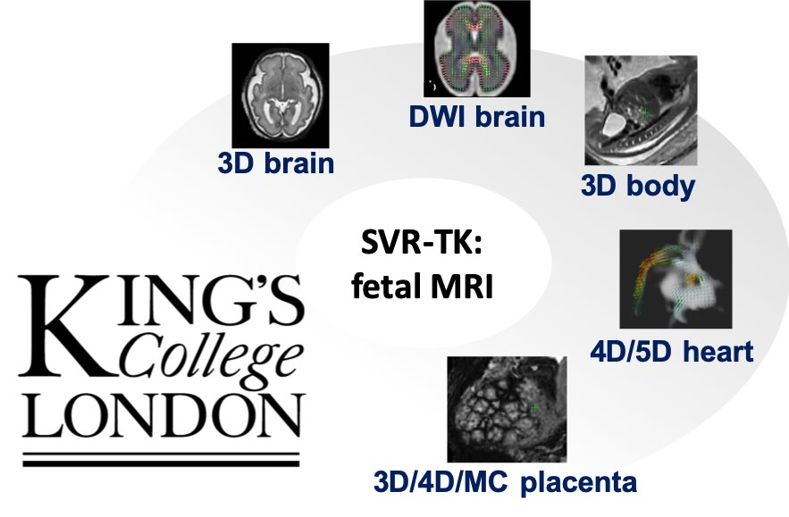

Introduction
==============================================

SVR reconstruction package for `MIRTK <https://biomedia.doc.ic.ac.uk/software/mirtk/>`_ for fetal MRI motion correction including:

- 3D brain
- 3D body
- 4D whole fetal heart, including magnitude and blood flow reconstructions
- 3D placenta
- 3D and 4D multi-channel T2*
- SH brain diffusion (HARDI)

The general pipeline for fetal brain reconstruction is based on the  `reconstruction`  function in `IRTK implemented by Maria Deprez <https://biomedia.doc.ic.ac.uk/software/irtk/>`_.

4D cardiac reconstruction code was ported from the `original IRTK-based implementation by Joshua van Amerom <https://github.com/jfpva/irtk_cardiac4d>`_.

SVRTK contributes to `fetal_cmr_4d <https://github.com/mriphysics/fetal_cmr_4d>`_ pipeline.

.. toctree::
   :maxdepth: 2
   :hidden:

   self
   docker
   installation
   run
   license
   citation
   _api/root
